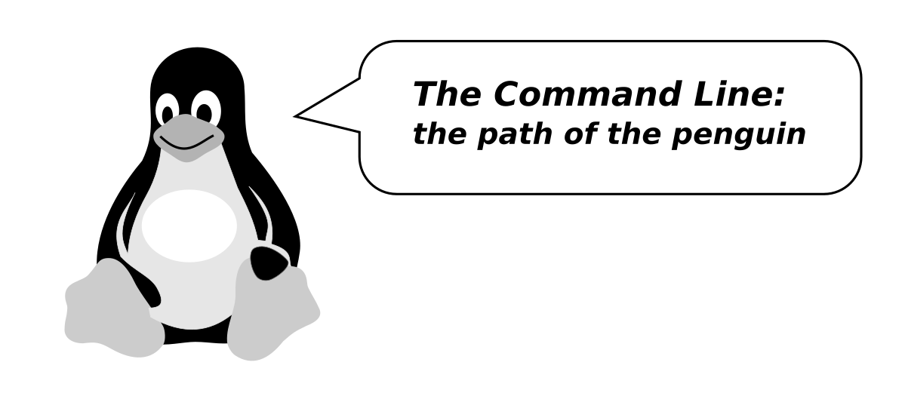

# Learning Path: The Command Line

Level 1: Beginner
=================

1.1 Navigate directories
------------------------

-   Check the current working directory with pwd
-   List contents of the current directory with ls -la
-   Change the current directory both up and down with cd
-   Explain the difference between a relative and absolute path
-   Type faster with the shortcuts \[TAB\] and \[UPARROW\]

1.2 Inspect text files
----------------------

-   List the contents of a file with cat, less or more
-   Search words inside text files with grep
-   Display differences between text files with diff
-   Edit a text file with nano or vi/vim

1.3 Copy and move files
-----------------------

-   Copy one or many files with cp
-   Rename or move a file or directory with mv
-   Remove a file with rm
-   Remove a directory with rmdir

Level 2: Intermediate
=====================

2.1 Permissions
---------------

-   Change permissions on a file with chmod
-   Explain the meaning of the 9 permissions bits on a file
-   Change ownership of a file with chown or chgrp
-   Override user privileges with sudo

2.2 Pipes
---------

-   Redirect output of a program to a text file
-   Redirect output of a program to another program
-   filter, sort, dedup and count lines/words within a pipeline
-   Separate the `stdout` and `stderr` streams

2.3 Networking
--------------

-   Log into a remote system with ssh
-   Copy files to/from a remote system with scp
-   Download a file from the web with curl or wget

2.4 System checks
-----------------

-   Check disk usage with df
-   Check directory sizes with du
-   List running processes with pwd or top
-   Kill a process with kill or xkill

2.5 System administration
-------------------------

-   Set an environment variable with `export`
-   Set an environment variable permanently in your .bashrc file
-   Execute a bash script with source
-   Install a program with apt (Debian/Ubuntu) or yum (RedHat)
-   Compile a program using `make`
-   Install Linux on your laptop
-   Explain what directories like /bin, /usr, /etc and /boot contain
-   Add multiple users and groups

Level 3: Advanced
=================

3.1 Administration
-------------------

-   Start a cronjob
-   Configure a service in the /env directory
-   Know the differences between Linux distributions
-   Compile a package from scratch
-   Load kernel modules or compile a Linux kernel

3.2 Networking
--------------

-   Run tools to analyze network traffic
-   Configure a local network
-   Install Linux on multiple remote machines simultaneously

3.3. Scripting
--------------

-   Write an installer script for a remote machine
-   Write bash scripts that contain variables, loops and conditional
    statements
-   Process system logs automatically
-   Enumerate more than 50 bash commands
