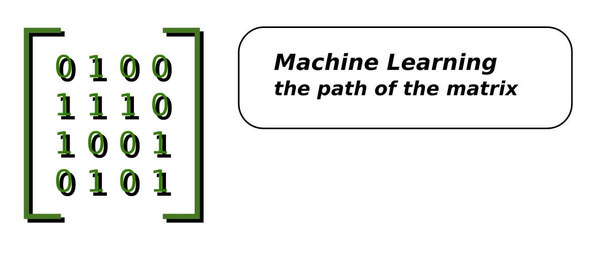

# Learning Path: Machine Learning

## Fundamentals

* define Machine Learning
* distinguish supervised and unsupervised learning
* distinguish classification and regression
* enumerate some Machine Learning methods
* draw the Machine Learning pyramid
* draw the data science venn diagram
* draw the Machine Learning venn diagram
* name prerequisites of Machine Learning
* name advantages of Machine Learning over normal programming
* enumerate applications of Machine Learning
* describe a typical workflow of a Machine Learning project

## Linear Algebra for Machine Learning

* add and multiply vectors
* calculate a dot product
* multiply a vector and a matrix
* multiply two matrices
* calculate eigenvalues / eigenvectors

## Feature Engineering

* distinguish MinMax scaling and standard scaling
* enumerate imputation strategies
* apply scaling
* apply one-hot encoding
* add binary features (e.g. for missing data)
* apply target mean encoding
* apply binning
* implement a scikit ColumnTransformer
* implement a scikit-learn pipeline

## Linear Regression

* train a linear model with a single coefficient
* train a linear model with a single coefficient and bias
* train a linear model with multiple coefficients
* explain what a hyperplane is
* explain multiple Linear Regression
* explain the least squares method
* plot coefficients of a Linear Model
* define the Gauss-Markov Theorem
* enumerate assumptions of Linear Regression
* check assumptions of Linear Regression
* explain the importance of Feature Engineering for linear models
* describe Generalized Linear Models (GLM)

## Logistic Regression

* define the sigmoid function
* train a Logistic Regression classification model
* interpret model parameters and metrics
* explain the log loss function
* calculate entropy of a variable
* calculate mutual information of two variables
* draw a decision boundary

## Gradient Descent

* define Gradient Descent
* explain what a convex function is
* define local and global minima
* name a loss function
* explain effects of a too small / too large learning rate 
* explain advantages of Gradient Descent over the Normal Equation
* explain Stochastic Gradient Descent (SGD)
* plot a learning curve
* explain a partial differential

## Model Evaluation

* perform a train-test split
* perform a train-validation-test split
* apply n-fold cross-validation
* enumerate evaluation metrics for classification
* calculate accuracy, precision, recall and F1-score
* plot a confusion matrix
* draw a precision recall curve
* plot and interpret a ROC curve
* calculate confidence intervals with bootstrapping
* enumerate evaluation metrics for regression
* distinguish MSE, MAE and MAPE

## Regularization

* explain overfitting
* explain underfitting
* explain the bias-variance tradeoff
* define Ridge regression
* explain why scaling is important in ridge
* train a ridge and lasso model

## Tree-based models

* train a decision tree
* Plot a decision tree
* train a Random Forest
* define a Voting Classifier
* name parameters and hyperparameters of tree-based models 
* explain regularization strategies for tree-based models
* describe the CART algorithm
* explain the GINI score
* apply Gradient Boosting
* distinguish bagging and boosting
* interpret a model with SMOTE

## Time Series Forecasting

* decompose a time series
* de-trend a time series
* de-season a time series
* apply a box-cox transformation
* interpret Acf and pAcf plots
* generate Naive Forecasts
* test for stationarity
* apply Exponential Smoothing
* apply an ARIMA model

## Text Processing

* Bag of Words
* TF-IDF
* tokenize text corpus
* remove stop words
* POS tagging
* lemmatization/stemming
* Word Vectors
* caclulate word vector similarity
* train a Naive Bayes model

## Model Optimization

* apply polynomial features
* apply interaction terms
* implement GridSearch
* apply an automated hyperparameter optimization procedure
* explain the No Free Lunch Theorem

## Clustering

* apply k-Means Clustering
* describe the k-Means algorithm
* apply Hierarchical Clustering
* apply DBScan
* calculate evaluation metrics for clustering methods
* explain the curse of dimensionality
* explain why scaling is necessary for clustering
* plot clusters

## Recommender Systems

* enumerate a few unsupervised learning methods and their applications
* calculate Cosine Similarity
* apply Item-based and User-based Collaborative Filtering
* apply Non-negative Matrix Factorization

## Other Machine Learning models

* Principal Component Analysis
* Gaussian Mixture Models for outlier detection
* simulate a Markov Chain
* parametriza a Markov Chain
* train a Hideen Markov Model (HMM)
* train a Support Vector Machine (SVM)
* Reinforcement Learning
* Semisupervised Learning

## Deep Learning

* manually calculate a single neuron
* enumerate activation functions
* explain the steps of Backpropagation
* create branched ANN architecture
* interpret learning curves
* implement a Feed-Forward Network
* data generator
* regularize a neural network
* load and save models
* enumerate loss functions
* describe batch gradient descent

## Deep Learning for images

* manually compute a convolutional kernel
* apply a pretrained CNN model
* apply transfer learning
* use a pretrained YOLO model
* use data augmentation
* explain neural image search

## Deep Learning for text

* explain a LSTM
* Attention mechanisms
* Transformer architecture
* use a GAN

## ML in production

* deploy a ML model with MLFlow
* explain data drift
* explain model drift
* monitor a model
* explain pros and cons of frequent retraining
* describe advantages and costs of distributed/GPU computing
* deploy a model through TensorFlow
* Monitor model performance continuously
* Explain benefit of a model to an organization
