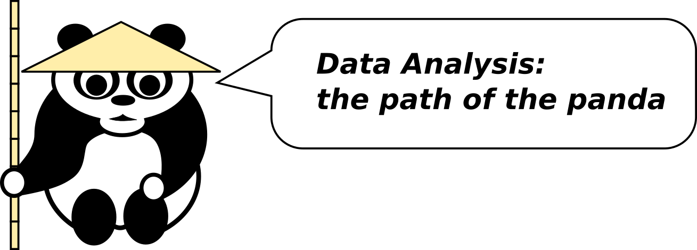

# Learning Path: Data Analysis

## 1. Beginner

### 1.1 Data Input

* load data from CSV files
* load data from Excel files
* retrieve CSV data from a URL

### Selecting Rows and Columns

### 1.2 Data Wrangling

* round values in a column to two digits
* apply a log or trigonometric function on a column
* concatenate two tables along an equal dimension
* insert missing values by a default value or backward/forward fill
* apply arithmetics on a column (`+ - * / ** %`)
* add / remove a column
* modify a single value in a table
* apply a function on a column
* slice a table in x/y direction
* extract unique values
* sort data by one or more columns (ascending/descending)
* check data types and the memory size of a dataset
* change the type of a column
* filter a table by values in one column
* transpose a table
* copy a table
* scale data to a fixed range or a normal distribution

### 1.3 Descriptive Statistics

* inspect the size of a table
* calculate mean, median, stdev, min and max for a column
* sum up a table by columns or rows
* count unique values
* bin data using quantiles or fixed intervals
* plot a histogram

### 1.4 Visualization

* plot a function y=f(x)
* draw barplots, line plots, scatterplots and histograms
* set axis labels and tick marks manually
* export high-resolution images in pixel and vector formats
* display mathematical symbols in a plot
* plot data on a log scale

----

## 2. Intermediate

### 2.1 Data Input

* import data from JSON
* import data from a SQL database
* scrape a small website
* connect to a web API
* parse data from HTML
* read text files containing errors
* write a custom file parser
* generate random data using different distributions

### 2.2 Data Wrangling

* merge two tables by a join condition
* insert missing values by interpolation or KNN
* set the index of a table
* construct hierarchical indexes
* convert long to wide format and back
* rename columns
* replace values mapped by category
* factorize a categorical column
* conduct a substring search on a column
* vertically shift a column
* find rows whose values is equal to the row exactly above
* alternatingly assign two rows to categories A and B (AABBAABB..)
* extract substrings from a string column
* concatenate two string columns
* convert a table to a list/dict/array and back
* apply Regular Expressions to extract data
* describe data

### 2.3 Descriptive Statistics

* aggregate groups using a custom function
* create a pivot table (count or sum using two columns as x and y dimensions)
* calculate correlations
* explain the difference between a correlation and covariance
* create a Q-Q-plot
* cluster the data
* find outliers
* describe common statistical pitfalls

### 2.4 Visualization

* color data points by a categorical variable
* color data points by a scalar
* draw error bars
* draw data on a map
* draw a choropleth
* animate data using a slider
* create a figure with multiple subplots
* draw a heatmap
* create a scatterplot matrix from multiple columns
* use timestamps as a x-axis
* export an animated plot

### 2.5 Time Series

* convert time zones
* decompose a time series (trend, seasonality, variability)
* plot the autocorrelation function (ACF) of a time series
* calculate a rolling average
* up- and downsample time stamps to a new frequency
* normalize by seasonal means
* apply a time delta on a column of time stamps
* apply a time delta on a column of time stamps, skipping weekends
* apply a Cox-Box transformation
* test a time series for stationarity

----

## 3. Advanced

### 3.1 Data Input

* scrape a larger website
* use OAuth to authenticate with a web API
* store data in a sparse matrix
* process datasets that does not fit in memory
* process datasets that do not fit on a single machine
* distribute operations on a large table to multiple computational nodes
* import data through stream processing
* schedule continuous updates of a dataset

### 3.2 Data Wrangling

* transform a dataset from one distribution to another
* store a binary tree in a data structure
* store a graph in a data structure
* convert a graph to an adjacency matrix and back
* calculate frequencies from time series data (signal processing/FFT)
* upsample/downsample a dataset
* draw stratified sub-samples

### 3.3 Descriptive Statistics

* test a column for normal distribution
* test a column for other distributions
* test two columns for equality of means
* test two categorical columns for equivalence
* calculate network centrality
* evaluate an A/B test
* describe data using a generative model (e.g. GMM)

### 3.4 Visualization

* draw a tree diagram
* draw a graph
* plot 3D data
* create interactive visualizations
* create customized graphics with other libraries
* create an online dashboard
